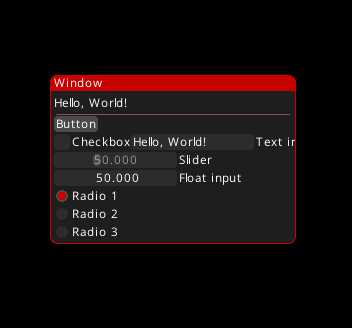

# VoxUI
VoxUI is an Immediate-Mode GUI system similar to Dear ImGui, But built specifically for C# Silk.NET so you don't have to use a pesky binding.

<hr>

VoxUI exposes all the internal methods that it uses to draw, allowing you to define custom drawing and inputs for your specific project.

## Getting started

VoxUI hooks into an existing Silk.NET window, meaning you have to set that up yourself.

VoxUI is only for .NET 10.0 or newer.

The only packages you need to install is VoxUI and Silk.NET along with its dependencies.
Use either a NuGet package manager or run the following command in your project:
```
dotnet package add Silk.NET
dotnet package add VoxUI
```

Here is an example of how to set up for VoxUI:

```csharp
using Silk.NET.Input;
using Silk.NET.OpenGL;
using Silk.NET.Windowing;

// Core of the library
using VoxUI.Core;

// Vectors
using VoxUI.Math;

// Rendering
using VoxUI.Rendering;

class program 
{
    public static IWindow AppWindow;
    public static GL OpenGL;
    public static IInputContext InputContext;
    
    static void Main(string[] args) 
    {
        // Create Silk.NET window
        WindowOptions options = WindowOptions.Default with
        {
            Title = "Silk.NET Window",
            Size = new(800,700),
        };
        
        AppWindow = Window.Create(options);

        // Listen to window's events
        AppWindow.Load += OnLoad;
        AppWindow.Render += OnRenderFrame;
        AppWindow.FramebufferResize += FrameBufferResize;
        
        // Init window
        AppWindow.Run();
    }
    
    private static void FrameBufferResize(Vector2D<int> obj)
    {
        OpenGL.Viewport(obj);
    }
    
    private static void OnLoad()
    {
        // Create GL and IInputContext
        InputContext = AppWindow.CreateInput();
        OpenGL = AppWindow.CreateOpenGL();
        
        // Pass the Silk.NET stuff to the VoxUI renderer
        Renderer.Gl = OpenGL;
        Renderer.Window = AppWindow;
        Renderer.InputContext = InputContext;
        
        // Initialize renderer
        Renderer.Init();
    }
    
    private static void OnRenderFrame(double deltaTime) 
    {
        Renderer.Update(deltaTime);
        
        // And here is where you do rendering
        
        Renderer.DoDraw();
    }
}
```

VoxUI has a few differences from Dear ImGui that you should be aware of.
Notably, now items that need data storage have an "item name" and a "display name" or "label".

Here is a window in Dear ImGui:
```csharp
ImGui.Begin("Window name");

// Etc

ImGui.End();
```

Here is a (dock safe) window in VoxUI:
```csharp
if (VoxUIR.Begin("WindowName", "Window display name")) 
{
    
    // Etc
    
    VoxUIR.End();
}
```

If you aren't planning on using docking, you can do the following:

```csharp
VoxUIR.Begin("WindowName", "Window display name");

// Etc

VoxUIR.End();
```

Now, outside the naming difference, most of the calls are the same:

```csharp
VoxUIR.Text("Hello, World!");

VoxUIR.Separator();

// .Button() doesn't need an ItemName because it has no need for data storage.
if (VoxUIR.Button("Button")) 
{
    Console.WriteLine("Clicked!");
}

// Same with checkbox
VoxUIR.Checkbox("Checkbox", ref SomeBool);

VoxUIR.SameLine();

VoxUIR.TextInput("ItemName", "Text input", ref SomeString);

VoxUIR.FloatSlider("ItemName", "Slider", ref SomeFloat, 25, 100, 0.1f);
VoxUIR.FloatInput("ItemName", "Float input", ref SomeFloat);

// Radio buttons are done as such:
VoxUIR.BeginRadio();
VoxUIR.RadioButton("Radio 1", ref Radio1);
VoxUIR.RadioButton("Radio 2", ref Radio2);
VoxUIR.RadioButton("Radio 3", ref Radio3);
VoxUIR.EndRadio();
```

And the result of the above mess of example code looks like this:



## Custom rendering

VoxUI exposes the methods it uses to deal with rendering and input. As such, you can make your own custom draw calls.

For example, here is the code for .Button():
```csharp
public static bool Button(string text, ButtonFlags buttonFlags = ButtonFlags.None)
{
    // Get the size of the text
    var size = RegularFont.GetTextSize(text);
    size.X += 4;

    // Account for next item size calls
    size = GetNextItemSize(size);

    var inactive = buttonFlags.HasFlag(ButtonFlags.Inactive);
        
    var color = UIStyle.ButtonColor;
    var pos = GetDrawPositionInScreenSpace();
        
    var clicked = false;

    // Handle input
    if (!inactive
        && IsMouseInsideRect(pos, size)
        && IsCurrentWindowHovered()
    )
    {
        if (IsMouseButtonDown(MouseButton.Left))
        {
            color = color.Lerp(Color4.Black, 0.2f);
        }
        else
        {
            color = color.Lerp(Color4.White, 0.1f);
            if (IsMouseButtonJustReleased(MouseButton.Left))
            {
                clicked = true;
            }
        }
    }
        
    // Render
    Renderer.AddRect(pos, size, color, CornerRadii.All(UIStyle.ButtonCornerRadius));
    Renderer.AddText(pos + new Vector2(2), text, UIStyle.TextSize, UIStyle.ButtonTextColor);

    if (inactive)
    {
        Renderer.AddRect(pos, size, new Color4(0,0,0,0.3f), CornerRadii.All(UIStyle.ButtonCornerRadius), zIndex:1);
    }
        
    // Move the draw cursor
    // (This call would be VoxUIR.Advance() outside of the VoxUIR class)
    Advance(0, size.Y + UIStyle.ItemSpacing, size.X, size.Y);
        
    // Return to X=0 in the case this was done after a SameLine() or VerticalSeparator() call
    // (This call would be VoxUIR.ReturnToBaseline() outside of the VoxUIR class)
    ReturnToBaseline();

    return clicked;
}
```
